# First-Order vs Second-Order Optimization Methods

This repository contains an experimental and theoretical comparison of **first-order**, **accelerated first-order**, **second-order**, and **quasi-Newton** optimization methods on a convex machine learning problem: **L2-regularized logistic regression**.

The project compares four optimization methods:

* **Gradient Descent (GD)**
* **Nesterov Accelerated Gradient (NAG)**
* **Newton's Method**
* **BFGS**

The main experiment is performed on the **LIBSVM Adult a9a** binary classification dataset. A second dataset, **LIBSVM w8a**, is added as a high-dimensional extension to study how Newton's Method changes when the number of features increases.

Repository link: [https://github.com/MohammedHydr/first-vs-second-order-optimization](https://github.com/MohammedHydr/first-vs-second-order-optimization)

---

## Project Overview

Optimization is central to machine learning because training a model usually means minimizing an objective function. Different optimization methods use different information about the objective:

* First-order methods use gradient information only.
* Accelerated first-order methods still use gradients, but add momentum or acceleration.
* Second-order methods use curvature information through the Hessian matrix.
* Quasi-Newton methods approximate curvature information without explicitly forming the exact Hessian every iteration.

This project studies the trade-off between these methods. First-order methods usually have cheaper iterations but may require many iterations. Newton's Method usually converges in fewer iterations, but each iteration is more expensive because it depends on the Hessian. BFGS sits between these two families by using approximate curvature information.

---

## Problem Formulation

The selected optimization problem is **binary logistic regression with L2 regularization**. For training samples `(x_i, y_i)`, where `y_i ∈ {0, 1}`, the model predicts:

```text
p_i = sigmoid(w^T x_i)
```

The optimized objective is the L2-regularized logistic loss:

```text
J(w) = (1/N) Σ [ log(1 + exp(w^T x_i)) - y_i w^T x_i ]
       + (λ / 2) ||w_reg||²
```

A bias term is added to the feature matrix, but the bias term is **not regularized**.

---

## Datasets

### Main Dataset: LIBSVM Adult a9a

| Split                      | Samples |
| -------------------------- | ------: |
| Training set               |  32,561 |
| Test set                   |  16,281 |
| Total                      |  48,842 |
| Features after adding bias |     124 |

The a9a dataset is used for the main comparison because it is large enough to show clear differences in convergence behavior, runtime, and scalability.

### High-Dimensional Extension: LIBSVM w8a

| Split                      | Samples |
| -------------------------- | ------: |
| Training set               |  49,749 |
| Test set                   |  14,951 |
| Total                      |  64,700 |
| Features after adding bias |     301 |

The w8a dataset is used as an additional extension because it has a larger feature dimension than a9a. This helps show how exact Hessian-based Newton updates become more expensive as the number of features increases.

---

## Methods Compared

| Method                        | Type                    | Information Used                       | Purpose                                   |
| ----------------------------- | ----------------------- | -------------------------------------- | ----------------------------------------- |
| Gradient Descent              | First-order             | Gradient only                          | Baseline first-order method               |
| Nesterov Accelerated Gradient | Accelerated first-order | Gradient and momentum                  | Compare acceleration with standard GD     |
| Newton's Method               | Second-order            | Gradient and exact Hessian             | Exact curvature-based method              |
| BFGS                          | Quasi-Newton            | Gradient-based curvature approximation | Practical approximate second-order method |

---

## Main Optimization Results on a9a

| Method                        | Iterations | Final Loss | Final Gradient Norm | Total Time (ms) | Mean/Iteration (ms) |
| ----------------------------- | ---------: | ---------: | ------------------: | --------------: | ------------------: |
| Gradient Descent              |       5000 |   0.332838 |          2.4270e-04 |       93,974.46 |              12.345 |
| Nesterov Accelerated Gradient |       5000 |   0.332713 |          1.2022e-06 |      140,664.42 |              11.122 |
| Newton's Method               |          7 |   0.332713 |          2.0956e-07 |        2,290.73 |             316.969 |
| BFGS                          |        200 |   0.332713 |          8.1398e-06 |        6,130.22 |              30.578 |

Newton's Method required the fewest iterations because it uses exact curvature information. Gradient Descent and Nesterov Accelerated Gradient used many more iterations, but their updates were cheaper. BFGS provided a practical middle ground by using approximate curvature information.

---

## Classification Results on a9a

| Method                        | Accuracy | Precision | Recall | F1 Score | ROC-AUC |
| ----------------------------- | -------: | --------: | -----: | -------: | ------: |
| Gradient Descent              |   0.8510 |    0.7311 | 0.5840 |   0.6493 |  0.9025 |
| Nesterov Accelerated Gradient |   0.8513 |    0.7313 | 0.5858 |   0.6505 |  0.9026 |
| Newton's Method               |   0.8513 |    0.7313 | 0.5858 |   0.6505 |  0.9026 |
| BFGS                          |   0.8513 |    0.7313 | 0.5858 |   0.6505 |  0.9026 |

The classification metrics are almost identical because all methods optimize the same logistic regression objective. The main difference is not final predictive performance, but how efficiently each method reaches the solution.

---

## Plots

All plot images are stored in the `plots/` folder.

### Main a9a Optimization Summary

#### Iterations Used

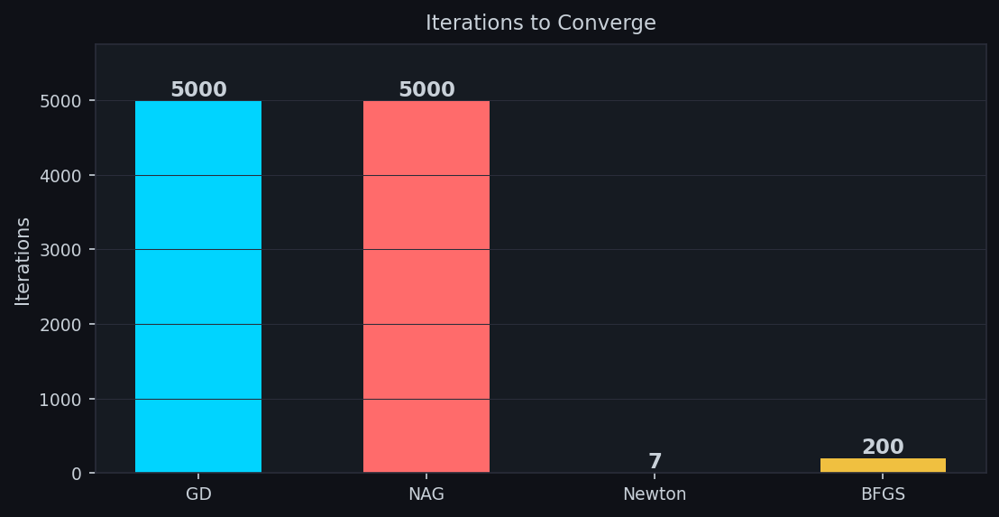

#### Total Training Time

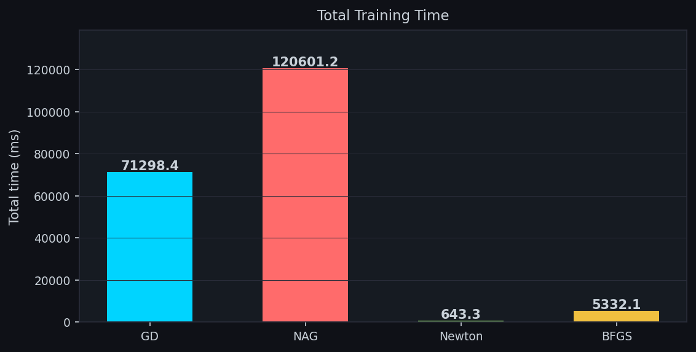

#### Runtime per Iteration

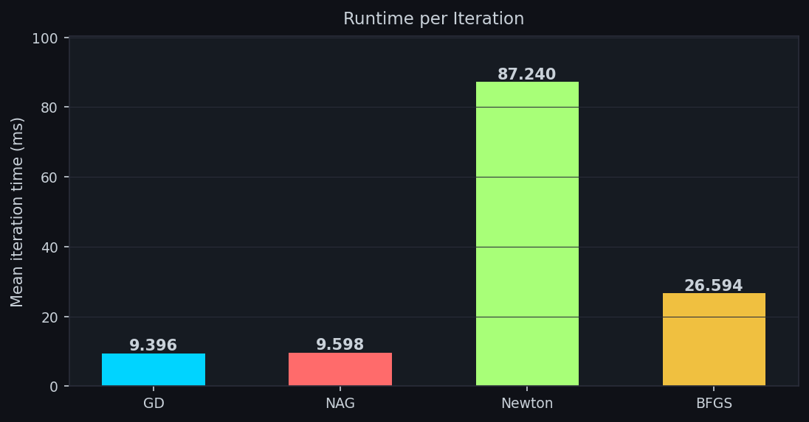

#### Final Objective Value

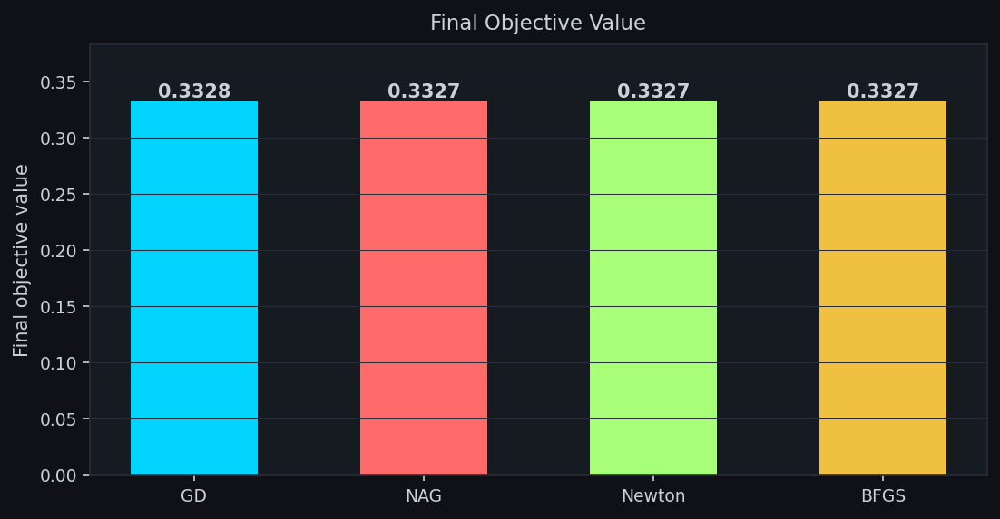

### a9a Convergence Behavior

#### Objective Value vs Iteration

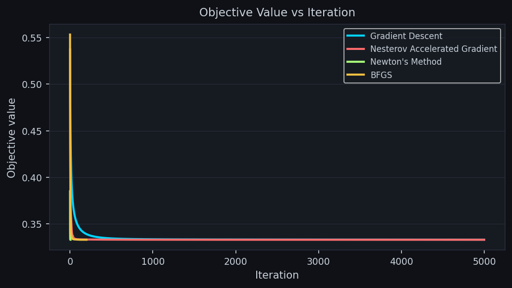

#### Gradient Norm vs Iteration

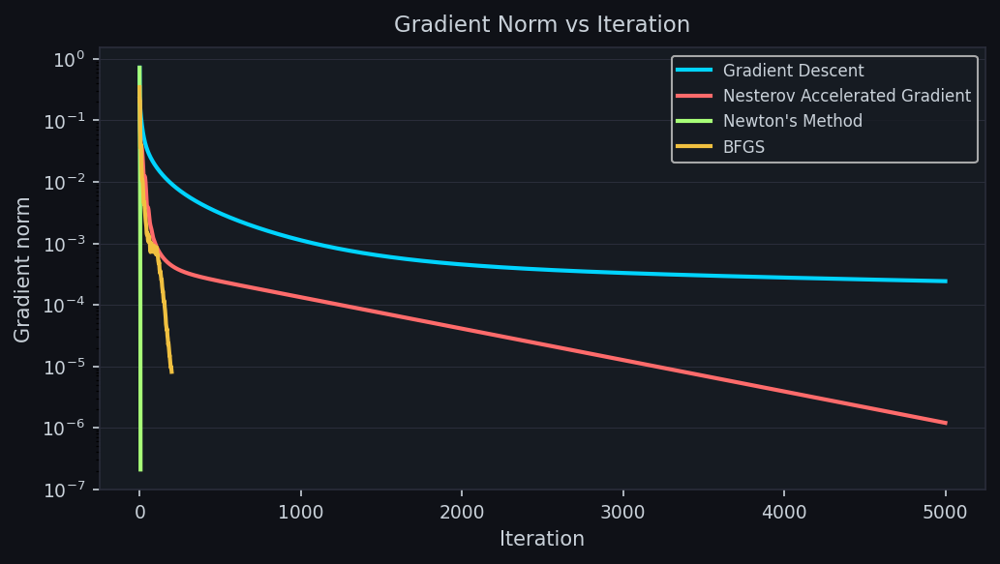

#### Objective Value vs Time

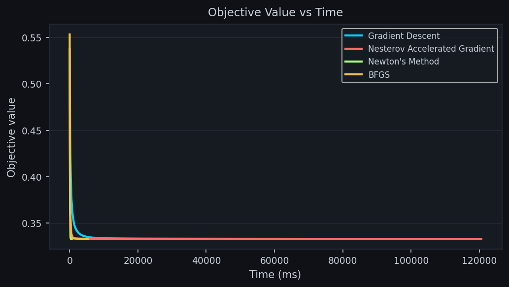

### a9a Scalability with Number of Samples

#### Total Runtime vs Problem Size

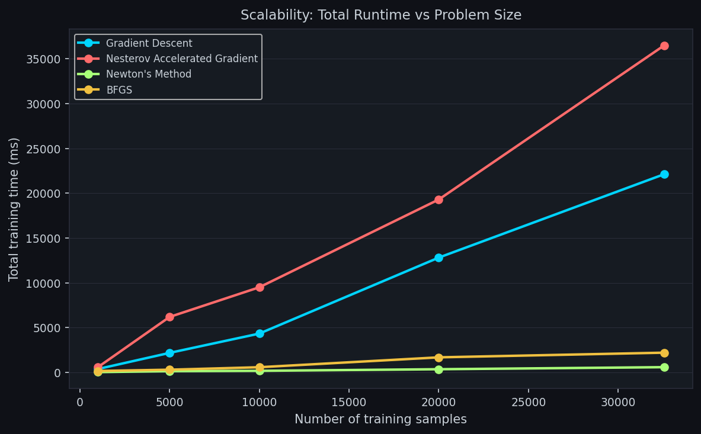

#### Cost per Iteration vs Problem Size

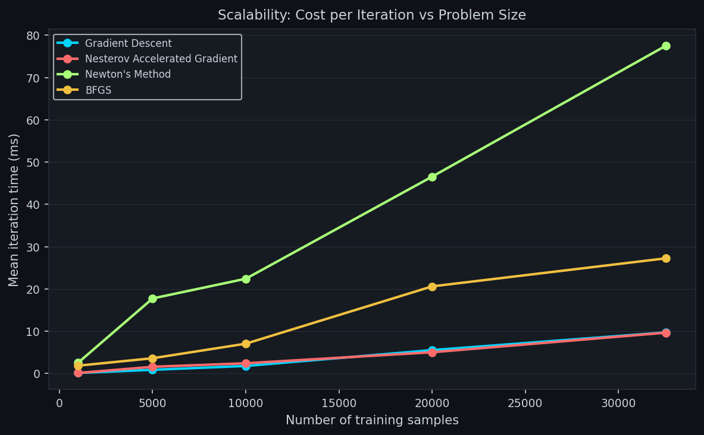

### w8a High-Dimensional Extension

#### Total Runtime on w8a

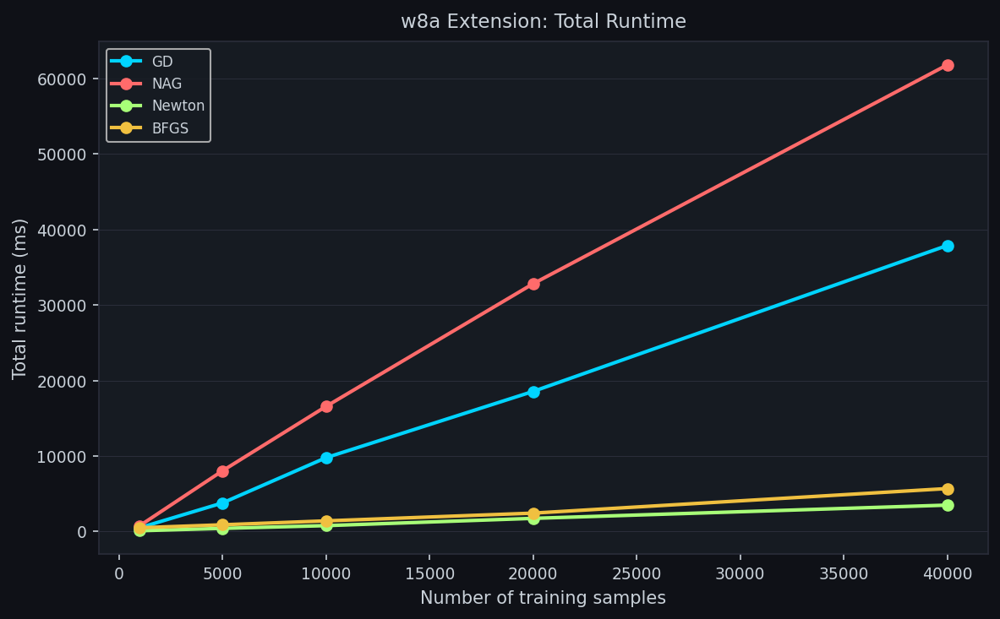

#### Cost per Iteration on w8a

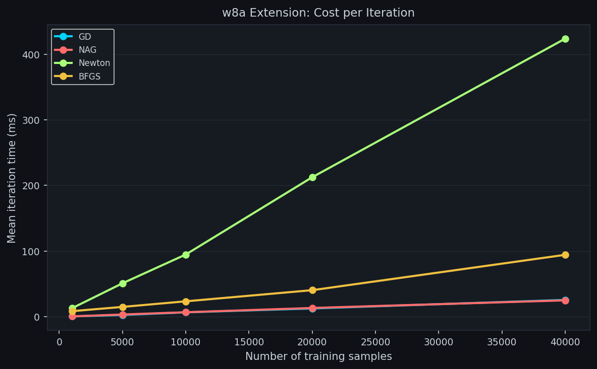

### Newton Comparison: a9a vs w8a

#### Newton Total Runtime: a9a vs w8a

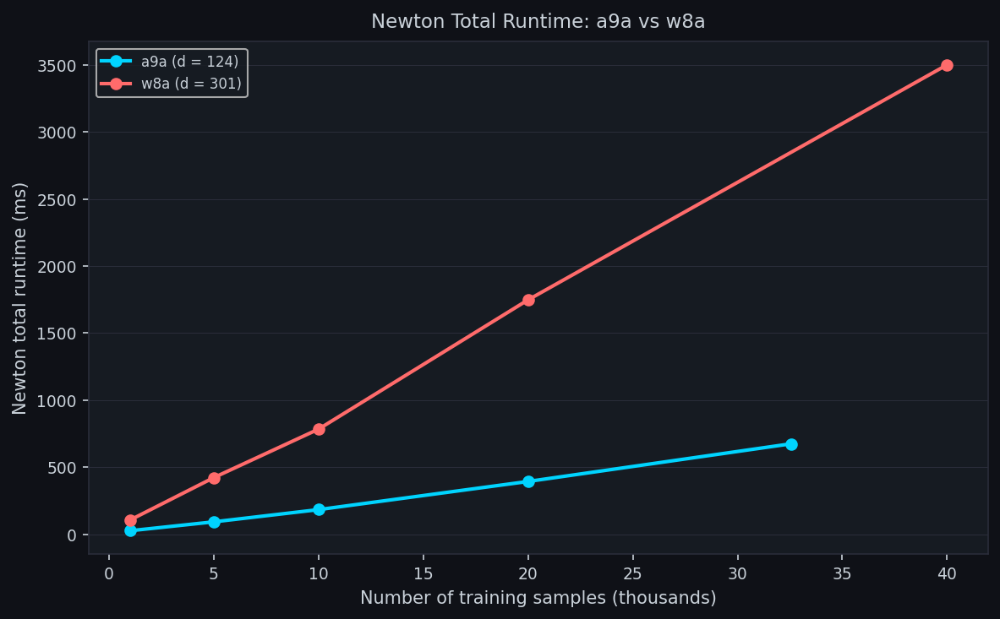

#### Newton Cost per Iteration: a9a vs w8a

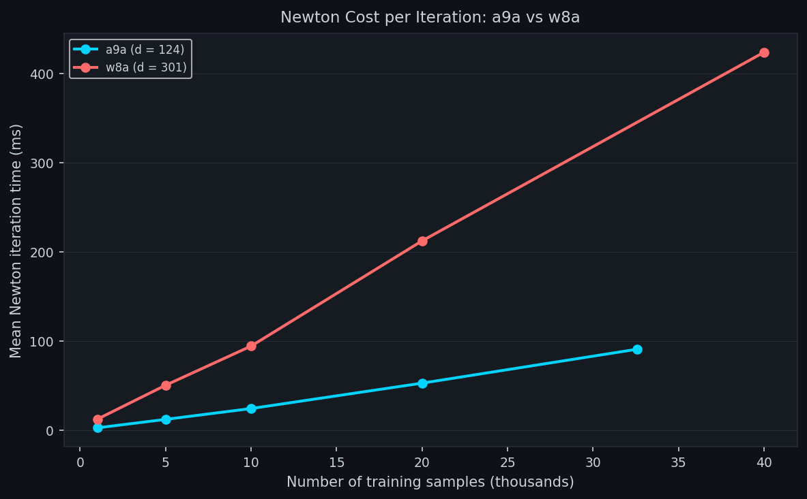

---

## Scalability Results on a9a

The a9a scalability experiment uses training subsets of size 1000, 5000, 10000, 20000, and 32561 samples.

| Samples | Method | Iterations | Total Time (ms) | Mean/Iter (ms) | Final Loss |
| ------: | ------ | ---------: | --------------: | -------------: | ---------: |
|    1000 | GD     |       1500 |          394.64 |          0.147 |   0.310596 |
|    1000 | NAG    |       1500 |          724.20 |          0.171 |   0.309624 |
|    1000 | Newton |          8 |           26.23 |          3.042 |   0.309609 |
|    1000 | BFGS   |         80 |          155.44 |          1.906 |   0.309879 |
|    5000 | GD     |       1500 |         4477.49 |          1.876 |   0.330993 |
|    5000 | NAG    |       1500 |         4486.21 |          1.122 |   0.330622 |
|    5000 | Newton |          7 |           92.63 |         12.555 |   0.330613 |
|    5000 | BFGS   |         80 |          320.83 |          3.985 |   0.330782 |
|   10000 | GD     |       1500 |         5131.93 |          2.145 |   0.336306 |
|   10000 | NAG    |       1500 |        10832.65 |          2.776 |   0.335925 |
|   10000 | Newton |          7 |          183.74 |         24.704 |   0.335914 |
|   10000 | BFGS   |         80 |         1837.46 |         22.907 |   0.336110 |
|   20000 | GD     |       1500 |        15046.79 |          6.546 |   0.334998 |
|   20000 | NAG    |       1500 |        25347.22 |          6.630 |   0.334678 |
|   20000 | Newton |          7 |          393.68 |         53.163 |   0.334667 |
|   20000 | BFGS   |         80 |         1564.54 |         19.440 |   0.334848 |
|   32561 | GD     |       1500 |        25282.40 |         11.145 |   0.333060 |
|   32561 | NAG    |       1500 |        41689.06 |         11.048 |   0.332725 |
|   32561 | Newton |          7 |          674.70 |         91.142 |   0.332713 |
|   32561 | BFGS   |         80 |         2562.26 |         31.672 |   0.332906 |

---

## High-Dimensional Extension Results on w8a

The w8a extension uses training subsets of size 1000, 5000, 10000, 20000, and 40000 samples. GD and NAG are run for 1000 iterations, Newton's Method is allowed to converge with a maximum of 30 iterations, and BFGS is run for 60 iterations.

| Samples | Method | Iterations | Total Time (ms) | Mean/Iter (ms) | Final Loss |
| ------: | ------ | ---------: | --------------: | -------------: | ---------: |
|    1000 | GD     |       1000 |          497.59 |          0.305 |   0.062053 |
|    1000 | NAG    |       1000 |          767.40 |          0.288 |   0.057269 |
|    1000 | Newton |          8 |          105.77 |         12.727 |   0.057269 |
|    1000 | BFGS   |         60 |          503.20 |          8.261 |   0.057329 |
|    5000 | GD     |       1000 |         3786.39 |          2.462 |   0.086679 |
|    5000 | NAG    |       1000 |         8039.78 |          3.183 |   0.083449 |
|    5000 | Newton |          8 |          422.27 |         50.830 |   0.083449 |
|    5000 | BFGS   |         60 |          896.13 |         14.772 |   0.083489 |
|   10000 | GD     |       1000 |         9778.83 |          6.486 |   0.087920 |
|   10000 | NAG    |       1000 |        16565.42 |          6.612 |   0.085437 |
|   10000 | Newton |          8 |          783.75 |         94.700 |   0.085437 |
|   10000 | BFGS   |         60 |         1413.53 |         23.303 |   0.085469 |
|   20000 | GD     |       1000 |        18552.71 |         12.408 |   0.090364 |
|   20000 | NAG    |       1000 |        32810.73 |         13.144 |   0.087940 |
|   20000 | Newton |          8 |         1747.63 |        212.639 |   0.087940 |
|   20000 | BFGS   |         60 |         2439.63 |         40.295 |   0.087971 |
|   40000 | GD     |       1000 |        37878.97 |         25.426 |   0.088473 |
|   40000 | NAG    |       1000 |        61791.90 |         24.757 |   0.086149 |
|   40000 | Newton |          8 |         3500.25 |        424.038 |   0.086149 |
|   40000 | BFGS   |         60 |         5691.61 |         94.235 |   0.086177 |

---

## Newton Comparison: a9a vs w8a

This comparison isolates Newton's Method to show the effect of increasing feature dimension. The a9a dataset uses 124 features after adding the bias term, while w8a uses 301 features.

| Dataset       | Samples | Iterations | Total Time (ms) | Mean/Iter (ms) | Final Loss |
| ------------- | ------: | ---------: | --------------: | -------------: | ---------: |
| a9a (d = 124) |    1000 |          8 |           26.23 |          3.042 |   0.309609 |
| a9a (d = 124) |    5000 |          7 |           92.63 |         12.555 |   0.330613 |
| a9a (d = 124) |   10000 |          7 |          183.74 |         24.704 |   0.335914 |
| a9a (d = 124) |   20000 |          7 |          393.68 |         53.163 |   0.334667 |
| a9a (d = 124) |   32561 |          7 |          674.70 |         91.142 |   0.332713 |
| w8a (d = 301) |    1000 |          8 |          105.77 |         12.727 |   0.057269 |
| w8a (d = 301) |    5000 |          8 |          422.27 |         50.830 |   0.083449 |
| w8a (d = 301) |   10000 |          8 |          783.75 |         94.700 |   0.085437 |
| w8a (d = 301) |   20000 |          8 |         1747.63 |        212.639 |   0.087940 |
| w8a (d = 301) |   40000 |          8 |         3500.25 |        424.038 |   0.086149 |

The Newton-only comparison confirms the theoretical expectation: increasing the feature dimension makes exact Hessian-based updates much more expensive. At around 10,000 samples, Newton's mean iteration time increases from about 24.704 ms on a9a to about 94.700 ms on w8a.

---

## Key Findings

* **Gradient Descent** is simple and cheap per iteration, but it requires many iterations.
* **Nesterov Accelerated Gradient** improves over standard Gradient Descent by reaching a lower loss and smaller gradient norm within the same iteration budget.
* **Newton's Method** converges in very few iterations because it uses exact Hessian information, but each iteration is more expensive.
* **BFGS** provides a strong practical compromise by approximating curvature information.
* On a9a, Newton's Method is very efficient because the feature dimension is moderate.
* On w8a, Newton's per-iteration cost increases sharply because the Hessian matrix is larger.
* The experiments show that exact second-order methods are powerful, but their cost grows significantly with feature dimension.

---

## Repository Structure

```text
.
├── README.md
├── LICENSE
├── requirements.txt
├── .gitignore
├── First-Order vs Second-Order Optimization.ipynb
├── report/
│   └── optimization_methods_report.tex
└── plots/
    ├── cmp_01_iterations.png
    ├── cmp_02_total_time.png
    ├── cmp_03_iter_time.png
    ├── cmp_04_final_loss.png
    ├── cmp_05_loss_vs_iteration.png
    ├── cmp_06_grad_norm_vs_iteration.png
    ├── cmp_07_loss_vs_time.png
    ├── cmp_08_scalability_total_runtime.png
    ├── cmp_09_scalability_iter_time.png
    ├── cmp_10_w8a_iter_time.png
    ├── cmp_11_w8a_total_runtime.png
    ├── cmp_10_newton_iter_time_a9a_vs_w8a.png
    └── cmp_11_newton_total_runtime_a9a_vs_w8a.png
```

---

## Installation

Create a virtual environment and install the dependencies:

```bash
python -m venv .venv
source .venv/bin/activate   # macOS/Linux
# .venv\Scripts\activate    # Windows

pip install -r requirements.txt
```

---

## Running the Notebook

Open the notebook:

```bash
jupyter notebook "First-Order vs Second-Order Optimization.ipynb"
```

or run it in Google Colab.

The notebook downloads the LIBSVM datasets, trains the optimization methods, evaluates the results, and saves the plots in the `plots/` folder.

---

## Dependencies

The main Python packages used are:

* NumPy
* Pandas
* Matplotlib
* scikit-learn
* SciPy
* Jupyter

---

## Authors

* Nemer Saab — `nas83@mail.aub.edu`
* Mohammed Haydar — `mhh87@mail.aub.edu`
* Issa Al Sabeh — `iha20@mail.aub.edu`

American University of Beirut

---

## License

This project is released under the MIT License. See the [LICENSE](LICENSE) file for details.
